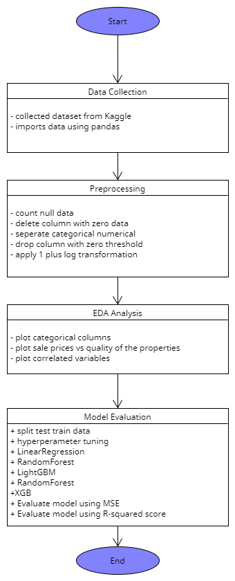

# Functional and non-function requirements of the project "Real Estate Price Analysis"

## Functional requirements:

1. Data Collection

- Collect data from Kaggle
- import the datasets using Pandas.

2. Preprocessing:

- Handle missing data, outliers, and categorical variables.
- Split the dataset into training and testing sets.

1. Exploratory Data Analysis (EDA):

- Provide statistical summaries of different variables.
- Generate visualizations such as boxplot, heatmap, and correlation matrices.

4. Model Evaluation:

- Evaluate the models using appropriate metrics such as Mean Square Error and R-Squared Score.
- Compare the performance of the three models

UML diagram:

## Non-Functional Requirements:

1. Usability:

- User-friendly, with clear instructions and outputs.

2. Performance:

- Efficiently handle large datasets.
- Provide fast response times during model training and prediction.

2. Reliability:

- Produce consistent and repeatable results across different runs.

3. Maintainability:

- Well-structured code and easy to understand.
- Easy to modify for future enhancements.

3. Documentation:

- All functions and modules should be well-documented.
- Provide a comprehensive user manual or guide.
